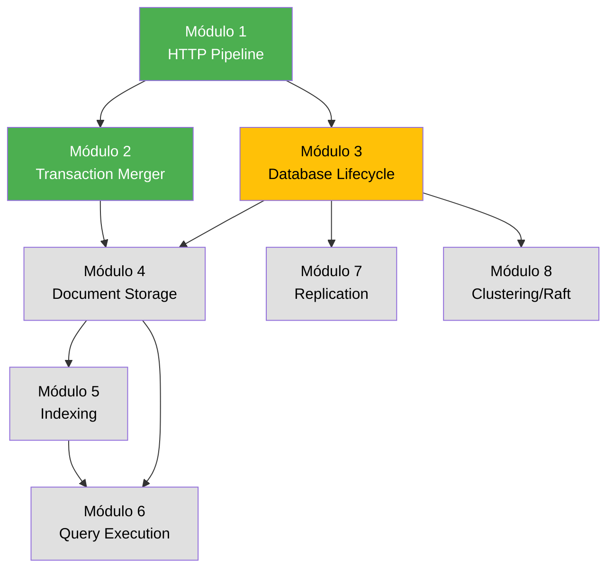

# ?? Raven.Server Deep Dive - Resumo Visual

## ?? Progresso Atual: 13.3% (2/15 Módulos)

```
?????????????????????????????????????????? 13.3%
```

---

## ??? Mapa de Navegação dos Módulos

### ? COMPLETOS

```
???????????????????????????????????????????????????????????????
? ?? MÓDULO 1: HTTP Request Pipeline & Routing               ?
???????????????????????????????????????????????????????????????
? Complexidade: ??? MÉDIA                                    ?
? Tempo: ~2-3h | LOC: ~5,000                                 ?
?                                                             ?
? ?? Técnicas:                                                ?
?  • Trie-Based Routing (5-20x speedup)                      ?
?  • Expression Trees Compilation (20-100x)                   ?
?  • Zero-Copy Streams                                        ?
?                                                             ?
? ?? Padrões:                                                 ?
?  • Trie Pattern • Flyweight • Template Method              ?
?  • Strategy • Decorator                                     ?
???????????????????????????????????????????????????????????????
```

```
???????????????????????????????????????????????????????????????
? ? MÓDULO 2: Transaction Merging System                     ?
???????????????????????????????????????????????????????????????
? Complexidade: ????? MUITO ALTA                            ?
? Tempo: ~5h | LOC: ~2,500+                                  ?
?                                                             ?
? ?? Técnicas:                                                ?
?  • Async Commit Overlap (40-50% throughput gain)           ?
?  • Object Pooling                                           ?
?  • High Dirty Memory Protection                             ?
?  • Operation Rejection                                      ?
?  • Transaction Recording                                    ?
?                                                             ?
? ?? Padrões:                                                 ?
?  • Producer-Consumer • RAII • Object Pool                   ?
?  • Circuit Breaker • Command                                ?
???????????????????????????????????????????????????????????????
```

### ?? PRÓXIMOS

```
???????????????????????????????????????????????????????????????
? ?? MÓDULO 3: DocumentDatabase Lifecycle                    ?
???????????????????????????????????????????????????????????????
? Complexidade: ???? ALTA                                    ?
? Prioridade: ?? CRÍTICA                                      ?
? Status: ?? PRÓXIMO NA FILA                                  ?
???????????????????????????????????????????????????????????????
```

---

## ?? Visualização de Dependências



**Legenda:**
- ?? Verde = Completo
- ?? Amarelo = Próximo
- ? Cinza = Pendente

---

## ?? Top 8 Técnicas de Performance Descobertas

| # | Técnica | Módulo | Speedup/Ganho |
|---|---------|--------|---------------|
| 1 | **Expression Trees Compilation** | 1 | 20-100x mais rápido |
| 2 | **Trie-Based Routing** | 1 | 5-20x mais rápido |
| 3 | **Async Commit Overlap** | 2 | 40-50% throughput |
| 4 | **Object Pooling** | 2 | ~70% menos GC |
| 5 | **Zero-Copy Streams** | 1 | Elimina cópias |
| 6 | **High Dirty Memory Protection** | 2 | Evita OOM |
| 7 | **Trie Masking** | 1 | O(1) lookup |
| 8 | **Operation Rejection** | 2 | Graceful degradation |

---

## ?? Top 10 Padrões de Design Catalogados

```
1. Trie Pattern          ????? [Módulo 1]
2. Producer-Consumer     ????? [Módulo 2]
3. RAII                  ????? [Módulo 2]
4. Object Pool           ????  [Módulo 2]
5. Template Method       ????  [Módulo 1]
6. Flyweight             ???   [Módulo 1]
7. Strategy              ???   [Módulo 1]
8. Decorator             ???   [Módulo 1]
9. Circuit Breaker       ???   [Módulo 2]
10. Command              ???   [Módulo 2]
```

---

## ?? Índice de Arquivos Principais Analisados

### Módulo 1: HTTP Pipeline
```
src/Raven.Server/
??? Routing/
?   ??? RequestRouter.cs           ????? (600+ linhas)
?   ??? RouteInformation.cs        ????  (300+ linhas)
?   ??? RavenActionAttribute.cs    ??    (100+ linhas)
?   ??? Trie.cs                    ????? (400+ linhas)
??? Web/
    ??? RequestHandler.cs          ????? (1500+ linhas)
```

### Módulo 2: Transaction Merging
```
src/Raven.Server/Documents/TransactionMerger/
??? AbstractTransactionOperationsMerger.cs  ????? (1000+ linhas)
??? DocumentsTransactionOperationsMerger.cs ????  (200+ linhas)
??? Commands/
    ??? MergedTransactionCommand.cs         ????  (300+ linhas)
    ??? DeleteDocumentCommand.cs            ???   (100+ linhas)
```

**Total LOC Analisadas:** ~7,500+ linhas

---

## ?? Principais Lições Aprendidas

### ? DO's (Faça)

```
? Use Trie para routing com muitas rotas conhecidas
? Compile handlers via Expression Trees (elimina reflection)
? Implemente batching inteligente para writes
? Use object pooling para objetos de vida curta
? Drene request body antes de enviar erros
? Atualize métricas com throttling (evita contenção)
? Implemente circuit breakers para proteção
? Use RAII pattern para resource management
```

### ? DON'Ts (Não Faça)

```
? Não use Trie se precisar de regex complexo
? Não otimize sem profile primeiro
? Não bloqueie o pipeline - sempre async/await
? Não ignore high dirty memory - pode causar OOM
? Não esqueça de fazer drain em error paths
? Não atualize métricas em cada request (throttle!)
```

---

## ?? Áreas de Código Mais Complexas

| Área | Complexidade | Razão |
|------|--------------|-------|
| `Trie.Optimize()` | ????? | Bit masking, collision handling |
| `AsyncCommitOverlap` | ????? | Coordenação async de 2 transações |
| `TryAuthorizeAsync` | ???? | Multi-level authorization logic |
| `HighDirtyMemoryProtection` | ???? | Cálculos de memória complexos |
| `Expression.Build()` | ???? | Construção de Expression Trees |

---

## ?? Estatísticas Detalhadas

### Distribuição de Complexidade
```
?????????? Muito Alta (40%)   - 6 módulos pendentes
????       Alta       (13%)   - 2 módulos pendentes  
??         Média      (13%)   - 1 módulo completo ?
?          Baixa      (13%)   - 2 módulos pendentes
```

### Prioridade
```
?? Crítica: 6 módulos (40%)
?? Alta:    5 módulos (33%)
?? Média:   3 módulos (20%)
? Baixa:   1 módulo  (7%)
```

### Tempo Estimado Restante
```
Completo:   ~7-8 horas  (13%)
Restante:  ~38-52 horas (87%)
????????????????????????????
Total:     ~45-60 horas
```

---

## ?? Próximos Passos Recomendados

### Opção 1: Sequencial (Construir Base)
```
? Módulo 3: DocumentDatabase Lifecycle
? Módulo 4: Document Storage
? Módulo 5: Indexing Subsystem
```

### Opção 2: Críticos (Performance-First)
```
? Módulo 5: Indexing Subsystem ?
? Módulo 6: Query Execution ?
? Módulo 8: Clustering/Raft ?
```

### Opção 3: Features (Application-Level)
```
? Módulo 7: Replication
? Módulo 9: Subscriptions
? Módulo 10: ETL
```

---

## ?? Como Usar Este Resumo

### Para Aprendizado
1. Leia os módulos completos em ordem
2. Foque nas técnicas de performance
3. Estude os padrões aplicados
4. Conecte com código real

### Para Referência
1. Busque por técnica específica (Ctrl+F)
2. Veja implementação em arquivos listados
3. Leia lições aprendidas
4. Aplique em seus projetos

### Para Contribuição
1. Identifique gaps
2. Sugira melhorias
3. Adicione exemplos
4. Corrija erros

---

## ?? Comandos Úteis

Para continuar a análise:

```bash
# Próximo na fila
"Analise o Módulo 3 do Raven.Server Deep Dive"

# Foco em performance
"Foque nos módulos críticos de performance"

# Específico
"Analise apenas o subsistema de indexing"
```

---

**?? Deep Dive Status:** 2/15 módulos completos (13.3%)

**?? Última Atualização:** Módulo 1 completo - HTTP Request Pipeline & Routing

**?? Links:**
- [Plano Completo](RAVEN-SERVER-DEEP-DIVE-PLAN.md)
- [Progresso Detalhado](DEEP-DIVE-PROGRESS.md)
- [Módulos README](raven-server-modules/README.md)
- [Módulo 1](raven-server-modules/MODULE-01-HTTP-Pipeline.md)
- [Módulo 2](raven-server-modules/MODULE-02-Transaction-Merging.md)
