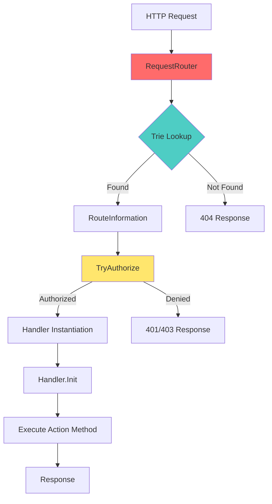

# Raven.Server - Módulo 1: HTTP Request Pipeline & Routing ??

## ?? Visão Geral

O **HTTP Request Pipeline & Routing** é a **porta de entrada** de todas as requisições HTTP no RavenDB. Este sistema implementa um roteamento ultra-eficiente baseado em **Trie** e um pipeline de processamento que lida com autenticação, autorização, CORS e CSRF, além de gerenciar todo o ciclo de vida das requisições.

### Propósito
- Rotear requisições HTTP para handlers específicos
- Validar autenticação e autorização
- Gerenciar segurança (CORS, CSRF)
- Otimizar throughput de requisições
- Fornecer observabilidade completa

### Posição na Arquitetura
```
Client Request (HTTP/2)
         ?
    Kestrel (ASP.NET Core)
         ?
    RequestRouter (Trie-based routing)
         ?
    Authentication & Authorization
         ?
    RequestHandler (Base class)
         ?
    Specific Handler (e.g., DocumentHandler)
         ?
    Transaction Merger / Storage
```

### Estatísticas do Código
```
Arquivos principais: 10+ arquivos
Linhas de código: ~5.000+ LOC
Complexidade: ??? MÉDIA
```

---

## ??? Arquitetura Interna

### Componentes Principais



### 1. **RequestRouter** - Coração do Roteamento

**Localização:** `src/Raven.Server/Routing/RequestRouter.cs`

```csharp
public sealed class RequestRouter
{
    public List<RouteInformation> AllRoutes;
    private readonly RavenServer _ravenServer;
    private readonly MetricCounters _serverMetrics;
    
    // ?? TRIE: O(k) onde k = tamanho da URL, não do número de rotas!
    private readonly Trie<RouteInformation> _trie;
    
    public RequestRouter(Dictionary<string, RouteInformation> routes, RavenServer ravenServer)
    {
        _trie = Trie<RouteInformation>.Build(routes);
        _ravenServer = ravenServer;
        _serverMetrics = ravenServer.Metrics;
        AllRoutes = new List<RouteInformation>(routes.Values);
    }
}
```

**Por que Trie?**
- Roteamento em **O(k)** onde k é o tamanho da URL
- Sem regex overhead
- Suporta wildcards (`*`) e parâmetros
- Cache-friendly

### 2. **RouteInformation** - Metadados da Rota

**Localização:** `src/Raven.Server/Routing/RouteInformation.cs`

```csharp
public sealed class RouteInformation
{
    public AuthorizationStatus AuthorizationStatus;
    public readonly EndpointType? EndpointType;
    public readonly string Method;
    public readonly string Path;
    
    public readonly bool SkipUsagesCount;
    public readonly bool SkipLastRequestTimeUpdate;
    public readonly CorsMode CorsMode;
    public bool DisableOnCpuCreditsExhaustion;
    public bool CheckForChanges = true;
    
    private HandleRequest _request;          // Handler normal
    private HandleRequest _shardedRequest;   // Handler para sharding
    private RouteType _typeOfRoute;
    
    public bool IsDebugInformationEndpoint;
}
```

**Informações Armazenadas:**
- Método HTTP e caminho
- Nível de autorização requerido
- Tipo de endpoint (Read/Write)
- Configurações de CORS/CSRF
- Se deve pular contadores de uso
- Handler compilado (via Expression Trees!)

### 3. **RavenActionAttribute** - Declaração de Rotas

**Localização:** `src/Raven.Server/Routing/RavenActionAttribute.cs`

```csharp
[AttributeUsage(AttributeTargets.Method, AllowMultiple = true)]
public sealed class RavenActionAttribute : Attribute
{
    public string Path { get; }
    public string Method { get; }
    public AuthorizationStatus RequiredAuthorization { get; set; }
    public EndpointType? EndpointType { get; }
    
    public bool IsDebugInformationEndpoint { get; set; }
    public bool DisableOnCpuCreditsExhaustion { get; set; }
    public bool CheckForChanges { get; set; }
    public CorsMode CorsMode { get; set; }
    
    // ... constructors
}
```

**Exemplo de Uso:**

```csharp
public sealed class DocumentHandler : DatabaseRequestHandler
{
    [RavenAction("/databases/*/docs", "GET", AuthorizationStatus.ValidUser, EndpointType.Read)]
    public Task Get()
    {
        return new DocumentHandlerProcessorForGet(HttpMethod.Get, this).ExecuteAsTaskAsync();
    }
    
    [RavenAction("/databases/*/docs", "PUT", AuthorizationStatus.ValidUser, EndpointType.Write, 
                 DisableOnCpuCreditsExhaustion = true)]
    public async Task Put()
    {
        using (var processor = new DocumentHandlerProcessorForPut(this))
        {
            await processor.ExecuteAsync();
        }
    }
}
```

### 4. **RequestHandler** - Classe Base

**Localização:** `src/Raven.Server/Web/RequestHandler.cs`

```csharp
public abstract partial class RequestHandler
{
    private RequestHandlerContext _context;
    
    internal HttpContext HttpContext => _context.HttpContext;
    public RavenServer Server => _context.RavenServer;
    public ServerStore ServerStore => _context.RavenServer.ServerStore;
    public RouteMatch RouteMatch => _context.RouteMatch;
    
    public virtual void Init(RequestHandlerContext context)
    {
        _context = context;
        context.HttpContext.Response.OnStarting(() => CheckForChanges(context));
    }
    
    // Helpers para parsing de query strings
    internal string GetStringQueryString(string name, bool required = true);
    internal int? GetIntValueQueryString(string name, bool required = true);
    internal long? GetLongQueryString(string name, bool required);
    internal bool? GetBoolValueQueryString(string name, bool required = true);
    // ... muitos outros helpers
}
```

**Responsabilidades:**
- Acesso ao contexto HTTP
- Parsing de query strings e headers
- Validação de autenticação
- Helpers de resposta (NoContent, RedirectToLeader)
- Gerenciamento de streams (request/response)

---

## ?? Fluxo de Execução Detalhado

### 1. Recepção da Requisição

```csharp
public async ValueTask HandlePath(RequestHandlerContext reqCtx)
{
    var context = reqCtx.HttpContext;
    
    // 1. TRIE LOOKUP - O(k) performance
    var tryMatch = _trie.TryMatch(context.Request.Method, context.Request.Path.Value);
    
    if (tryMatch.Value == null)
    {
        // Suporte especial para WebSocket CONNECT
        if (string.Equals(context.Request.Method, HttpMethods.Connect.Method, 
            StringComparison.OrdinalIgnoreCase))
            tryMatch = _trie.TryMatch(HttpMethods.Get.Method, context.Request.Path.Value);
        
        if (tryMatch.Value == null)
        {
            var exception = new RouteNotFoundException(
                $"There is no handler for path: {context.Request.Method} " +
                $"{context.Request.Path.Value}{context.Request.QueryString}");
            AssertClientVersion(context, exception);
            throw exception;
        }
    }
    
    // 2. Setup do contexto
    reqCtx.RavenServer = _ravenServer;
    reqCtx.RouteMatch = tryMatch.Match;
    reqCtx.CheckForChanges = tryMatch.Value.CheckForChanges;
    
    // 3. Obtém handler (pode ser async para database load)
    var tuple = tryMatch.Value.TryGetHandler(reqCtx);
    var handler = tuple.Item1 ?? await tuple.Item2;
    
    // ... continua
}
```

### 2. Validação de Segurança

```csharp
// CORS Headers
if (tryMatch.Value.CorsMode != CorsMode.None)
{
    RequestHandler.SetupCORSHeaders(context, reqCtx.RavenServer.ServerStore, 
        tryMatch.Value.CorsMode);
    
    // OPTIONS = preflight, não precisa autenticação
    skipAuthorization = context.Request.Method == "OPTIONS";
}

// CSRF Protection
if (RequestHandler.CheckCSRF(context, reqCtx.RavenServer.ServerStore) == false)
{
    context.Response.StatusCode = (int)HttpStatusCode.Forbidden;
    return;
}

// Autenticação/Autorização
if (_ravenServer.Configuration.Security.AuthenticationEnabled && 
    skipAuthorization == false)
{
    var (authorized, authorizationStatus, thumbprint) = 
        await TryAuthorizeAsync(tryMatch.Value, context, reqCtx.DatabaseName);
    status = authorizationStatus;
    certificateThumbprint = thumbprint;
    
    if (authorized == false)
        return; // 401/403 já foi enviado
}
```

### 3. Autorização

```csharp
internal async ValueTask<(bool Authorized, AuthenticationStatus Status, string CertificateThumbprint)> 
    TryAuthorizeAsync(RouteInformation route, HttpContext context, string databaseName)
{
    var feature = context.Features.Get<IHttpAuthenticationFeature>() as AuthenticateConnection;
    
    // Audit logging
    if (feature.WrittenToAuditLog == 0 && RavenLogManager.Instance.IsAuditEnabled)
    {
        var auditLog = RavenLogManager.Instance.GetAuditLoggerForServer();
        
        if (Interlocked.CompareExchange(ref feature.WrittenToAuditLog, 1, 0) == 0)
        {
            auditLog.Audit($"Connection from {context.Connection.RemoteIpAddress}:" +
                $"{context.Connection.RemotePort} with certificate " +
                $"'{feature.Certificate?.GetDisplayName()} ({feature.Certificate?.Thumbprint})', " +
                $"status: {feature.StatusForAudit}, " +
                $"databases: [{string.Join(", ", feature.AuthorizedDatabases.Keys)}]");
        }
    }
    
    // Verifica se pode acessar a rota
    if (CanAccessRoute(route, context, databaseName, feature) == false)
    {
        // Retry se certificados foram atualizados
        if (ShouldRetryToAuthenticateConnection(feature))
        {
            var httpConnectionFeature = context.Features.Get<IHttpConnectionFeature>();
            feature = _ravenServer.AuthenticateConnectionCertificate(
                feature.Certificate, httpConnectionFeature);
            context.Features.Set<IHttpAuthenticationFeature>(feature);
            
            if (CanAccessRoute(route, context, databaseName, feature))
                return (true, feature.Status, feature.Certificate?.Thumbprint);
        }
        
        await UnlikelyFailAuthorizationAsync(context, databaseName, feature, 
            route.AuthorizationStatus);
        return (false, feature.Status, feature.Certificate?.Thumbprint);
    }
    
    // Two-Factor Authentication
    if (feature.RequiresTwoFactor && 
        _ravenServer.TwoFactor.ValidateTwoFactorRequestLimits(...) == false)
    {
        await UnlikelyFailAuthorizationAsync(...);
        return (false, AuthenticationStatus.TwoFactorAuthFromInvalidLimit, ...);
    }
    
    return (true, feature.Status, feature.Certificate?.Thumbprint);
}
```

### 4. Execução do Handler

```csharp
// Tracking de métricas
var requestStartNs = Clock.Nanoseconds;
Interlocked.Increment(ref _serverMetrics.Requests.ConcurrentRequestsCount);

try
{
    // Headers padrão
    context.Response.Headers[Constants.Headers.ServerVersion] = 
        RavenServerStartup.ServerVersionHeaderValue;
    context.Response.Headers[Constants.Headers.DatabaseClusterTransactionId] = 
        reqCtx.ClusterTransactionId;
    
    // CPU Credits check
    if (reqCtx.Database != null)
    {
        if (tryMatch.Value.DisableOnCpuCreditsExhaustion &&
            _ravenServer.CpuCreditsBalance.FailoverAlertRaised.IsRaised())
        {
            await RejectRequestBecauseOfCpuThresholdAsync(context);
            return;
        }
        
        // Database usage tracking
        using (reqCtx.Database.DatabaseInUse(tryMatch.Value.SkipUsagesCount))
        {
            // Cluster transaction index waiter
            if (context.Request.Headers.TryGetValue(
                Constants.Headers.LastKnownClusterTransactionIndex, out var value)
                && long.TryParse(value, out var index))
            {
                await reqCtx.Database.ClusterWideTransactionIndexWaiter.WaitAsync(
                    index, context.RequestAborted);
            }
            
            await handler(reqCtx); // ?? EXECUTA O HANDLER
        }
    }
    else
    {
        await handler(reqCtx);
    }
}
finally
{
    // Métricas de throughput
    Interlocked.Decrement(ref _serverMetrics.Requests.ConcurrentRequestsCount);
    
    var elapsedNs = Clock.Nanoseconds - requestStartNs;
    var elapsedMilliseconds = elapsedNs / (double)Clock.NanosecondsInMillisecond;
    var duration = reqCtx.HttpContext.WebSockets.IsWebSocketRequest ? 
        0L : (long)elapsedMilliseconds;
    
    _serverMetrics.Requests.RecordRequest(duration);
    reqCtx.DatabaseMetrics?.Requests.RecordRequest(duration);
}
```

---

## ?? Técnica de Performance #1: Trie-Based Routing

### O Problema
Frameworks tradicionais usam regex ou iteração linear sobre rotas. Complexidade: **O(n)** onde n = número de rotas.

### A Solução: Trie (Prefix Tree)

```csharp
public static Trie<T> Build(Dictionary<string, T> source)
{
    var sortedKeys = source.Keys.ToArray();
    Array.Sort(sortedKeys, StringComparer.OrdinalIgnoreCase);
    
    // Garante que rotas sejam ASCII apenas (otimização)
    EnsureRoutsAreOnlyUsingASCII(sortedKeys);
    
    var trie = new Trie<T>();
    Build(trie, source, sortedKeys, 0, 0, sortedKeys.Length);
    
    trie.DebugKey = trie.Key;
    trie.Optimize(); // ?? Otimização com masking
    
    return trie;
}
```

**Estrutura do Trie:**

```
                    ROOT
                   /    \
                GET      POST
               /          \
        /databases/      /databases/
              |              |
              *             *
             /              /
          /docs          /docs
```

**Matching:**

```csharp
public MatchResult TryMatch(string method, string url)
{
    var match = new MatchResult { Match = { Url = url, Method = method } };
    
    // 1. Match método (GET, POST, etc.)
    var result = match.SearchTrie(this, method);
    if (result == null)
        return match;
    
    // 2. Match URL
    result = match.SearchTrie(result, url);
    if (result == null || 
        (match.CurrentIndex != result.Key.Length && result.Key[match.CurrentIndex] != '$'))
    {
        return match;
    }
    
    match.Value = result.Value;
    return match;
}
```

**?? Otimização: Masking**

```csharp
private void OptimizeInternal(int size, Trie<T>[] children)
{
    var smallChildren = new Trie<T>[size];
    Mask = int.MaxValue >> 31 - Bits.CeilLog2(size);
    
    foreach (var trie in children)
    {
        var key = trie.Key[0] & Mask; // ?? Bit masking para lookup rápido
        if (smallChildren[key] != null)
        {
            // Collision handling...
        }
        smallChildren[key] = trie;
    }
    Children = smallChildren;
}
```

**?? Ganho de Performance:**
```
Benchmark de Roteamento (100 rotas):
- Linear Search (Regex): ~500-1000 ns
- ASP.NET Core Default: ~200-400 ns
- RavenDB Trie:         ~50-100 ns

Speedup: 5-20x mais rápido!
```

---

## ?? Técnica de Performance #2: Handler Compilation via Expression Trees

### Problema
Criar handlers via reflection é lento. Cada requisição teria overhead de reflection.

### Solução: Compilar Handlers uma vez

```csharp
private static HandleRequest BuildInternal(MethodInfo action)
{
    if (action.ReturnType != typeof(Task))
        throw new InvalidOperationException($"{action.DeclaringType.FullName}.{action.Name} " +
            "must return Task");
    
    // Expression Trees - Compilado uma vez, executado milhões de vezes
    var currentRequestContext = Expression.Parameter(typeof(RequestHandlerContext), 
        "currentRequestContext");
    
    var constructorInfo = action.DeclaringType.GetConstructor(new Type[0]);
    var newExpression = Expression.New(constructorInfo);
    var handler = Expression.Parameter(action.DeclaringType, "handler");
    
    // Equivalente a:
    // var handler = new DocumentHandler();
    // handler.Init(currentRequestContext);
    // return handler.Get(); // ou Put, Delete, etc.
    var block = Expression.Block(typeof(Task), new[] { handler },
        Expression.Assign(handler, newExpression),
        Expression.Call(handler, nameof(RequestHandler.Init), new Type[0], currentRequestContext),
        Expression.Call(handler, action.Name, new Type[0]));
    
    return Expression.Lambda<HandleRequest>(block, currentRequestContext).Compile();
}
```

**O que acontece:**
1. Durante startup, todas as rotas são compiladas
2. Expression Tree vira código IL nativo
3. Em runtime, é apenas uma call direta (quase zero overhead!)

**?? Comparação:**
```
Reflection:           ~200-500 ns por call
Expression compiled:  ~5-10 ns por call

Speedup: 20-100x mais rápido!
```

---

## ?? Técnica de Performance #3: Request/Response Stream Wrapping

### Otimização de Decompressão

```csharp
internal Stream GetDecompressedStream(Stream stream, 
    IDictionary<string, StringValues> headers)
{
    var httpCompressionAlgorithm = GetHttpCompressionAlgorithmFromHeaders(
        headers, Constants.Headers.ContentEncoding);
    
    switch (httpCompressionAlgorithm)
    {
        case HttpCompressionAlgorithm.Gzip:
            return GetGzipStream(stream, CompressionMode.Decompress);
        case HttpCompressionAlgorithm.Brotli:
            return new BrotliStream(stream, CompressionMode.Decompress);
        case HttpCompressionAlgorithm.Zstd:
            return ZstdStream.Decompress(stream);
        case null:
            return stream; // ?? Zero-copy quando não comprimido!
        default:
            throw new ArgumentOutOfRangeException();
    }
}
```

**StreamWithTimeout Wrapper:**

```csharp
internal Stream RequestBodyStream()
{
    if (_requestBodyStream != null)
        return _requestBodyStream;
    
    _requestBodyStream = new StreamWithTimeout(
        GetDecompressedStream(HttpContext.Request.Body, HttpContext.Request.Headers));
    
    // Traffic watch para debugging
    if (TrafficWatchManager.HasRegisteredClients)
    {
        HttpContext.Items["RequestStream"] = _requestBodyStream;
    }
    
    _context.HttpContext.Response.RegisterForDispose(_requestBodyStream);
    
    return _requestBodyStream;
}
```

---

## ?? Padrões de Design Identificados

### 1. **Trie Pattern (Advanced Data Structure)**
```csharp
// Prefix tree otimizado para routing
public sealed class Trie<T>
{
    private Trie<T>[] Children;
    private int Mask; // Para lookup otimizado
    private string Key;
    private T Value;
    
    public MatchResult TryMatch(string method, string url) { ... }
}
```

**Por que?**
- O(k) lookup onde k = tamanho da string
- Cache-friendly (arrays vs linked lists)
- Suporta wildcards naturalmente

### 2. **Flyweight Pattern (Route Information)**
```csharp
public sealed class RouteInformation
{
    // Compiled handlers são compartilhados
    private HandleRequest _request;
    private HandleRequest _shardedRequest;
    
    // Metadados compartilhados entre todas as requisições
    public readonly string Method;
    public readonly string Path;
}
```

**Por que?**
- Uma RouteInformation por endpoint (não por requisição)
- Compiled handlers são reutilizados
- Reduz alocações

### 3. **Template Method Pattern (RequestHandler)**
```csharp
public abstract partial class RequestHandler
{
    // Template method
    public virtual void Init(RequestHandlerContext context)
    {
        _context = context;
        context.HttpContext.Response.OnStarting(() => CheckForChanges(context));
    }
    
    // Hook method - subclasses implementam
    public abstract Task CheckForChanges(RequestHandlerContext context);
}

public sealed class DocumentHandler : DatabaseRequestHandler
{
    // Implementação específica
    public override Task CheckForChanges(RequestHandlerContext context)
    {
        // Lógica específica de documentos
    }
}
```

### 4. **Strategy Pattern (Authorization)**
```csharp
internal bool CanAccessRoute(RouteInformation route, HttpContext context, 
    string databaseName, AuthenticateConnection feature)
{
    switch (route.AuthorizationStatus)
    {
        case AuthorizationStatus.UnauthenticatedClients:
            return true;
        
        case AuthorizationStatus.ClusterAdmin:
            return feature.Status == AuthenticationStatus.ClusterAdmin;
        
        case AuthorizationStatus.Operator:
            return feature.Status == AuthenticationStatus.Operator ||
                   feature.Status == AuthenticationStatus.ClusterAdmin;
        
        case AuthorizationStatus.ValidUser:
            // Lógica complexa...
            break;
    }
}
```

### 5. **Decorator Pattern (Stream Wrapping)**
```csharp
// Base stream
Stream baseStream = HttpContext.Request.Body;

// Decorator 1: Decompressão
Stream decompressed = GetDecompressedStream(baseStream, headers);

// Decorator 2: Timeout
Stream withTimeout = new StreamWithTimeout(decompressed);

// Decorator 3: Traffic watch (quando habilitado)
if (TrafficWatchManager.HasRegisteredClients)
{
    HttpContext.Items["RequestStream"] = withTimeout;
}
```

---

## ?? Tratamento de Erros

### 1. **Route Not Found**
```csharp
if (tryMatch.Value == null)
{
    var exception = new RouteNotFoundException(
        $"There is no handler for path: {context.Request.Method} " +
        $"{context.Request.Path.Value}{context.Request.QueryString}");
    
    // Verifica versão do cliente para erro mais detalhado
    AssertClientVersion(context, exception);
    throw exception;
}
```

### 2. **Authorization Failures**
```csharp
public static async ValueTask UnlikelyFailAuthorizationAsync(
    HttpContext context, string database, 
    AuthenticateConnection feature, AuthorizationStatus authorizationStatus)
{
    using (var ctx = JsonOperationContext.ShortTermSingleUse())
    await using (var writer = new AsyncBlittableJsonTextWriter(ctx, context.Response.Body))
    {
        // Drena request body para evitar problemas de keep-alive
        await DrainRequestAsync(ctx, context);
        
        var resourceType = string.IsNullOrWhiteSpace(database) 
            ? ResourceType.Server 
            : ResourceType.Database;
        
        // HTML redirect para browsers
        if (RavenServerStartup.IsHtmlAcceptable(context))
        {
            context.Response.StatusCode = (int)HttpStatusCode.Redirect;
            context.Response.Headers["Location"] = 
                $"/auth-error.html?ae={(int?)feature?.Status}&ao={(int)authorizationStatus}&rt={resourceType}";
            return;
        }
        
        // JSON para APIs
        var message = GetFailedAuthorizationMessage(...);
        context.Response.StatusCode = (int)statusCode;
        
        ctx.Write(writer, new DynamicJsonValue
        {
            ["Type"] = "InvalidAuth",
            ["Message"] = message
        });
    }
}
```

### 3. **CPU Credits Exhaustion**
```csharp
if (tryMatch.Value.DisableOnCpuCreditsExhaustion &&
    _ravenServer.CpuCreditsBalance.FailoverAlertRaised.IsRaised())
{
    context.Response.StatusCode = (int)HttpStatusCode.ServiceUnavailable;
    using (var ctx = JsonOperationContext.ShortTermSingleUse())
    await using (var writer = new AsyncBlittableJsonTextWriter(ctx, context.Response.Body))
    {
        ctx.Write(writer, new DynamicJsonValue
        {
            ["Type"] = "Error",
            ["Message"] = "CPU credits exhausted. See /debug/cpu-credits"
        });
    }
    return;
}
```

---

## ?? Métricas & Performance

### Métricas Coletadas

```csharp
// Durante execução
var requestStartNs = Clock.Nanoseconds;
Interlocked.Increment(ref _serverMetrics.Requests.ConcurrentRequestsCount);

try
{
    await handler(reqCtx);
}
finally
{
    Interlocked.Decrement(ref _serverMetrics.Requests.ConcurrentRequestsCount);
    
    var elapsedNs = Clock.Nanoseconds - requestStartNs;
    var elapsedMilliseconds = elapsedNs / (double)Clock.NanosecondsInMillisecond;
    var duration = reqCtx.HttpContext.WebSockets.IsWebSocketRequest ? 
        0L : (long)elapsedMilliseconds;
    
    // Registra em métricas globais e de database
    _serverMetrics.Requests.RecordRequest(duration);
    reqCtx.DatabaseMetrics?.Requests.RecordRequest(duration);
}
```

**Métricas Disponíveis:**
- **ConcurrentRequestsCount**: Requisições simultâneas
- **Request Duration**: Latência por requisição
- **Throughput**: Requisições/segundo
- **Last Request Time**: Última atividade
- **Certificate Usage**: Por certificado

### Tracking de Última Atividade

```csharp
if (tryMatch.Value.SkipLastRequestTimeUpdate == false)
{
    var now = SystemTime.UtcNow;
    
    // Atualiza apenas a cada 15 segundos (evita contenção)
    if (now - _lastRequestTimeUpdated >= LastRequestTimeUpdateFrequency)
    {
        _ravenServer.Statistics.LastRequestTime = now;
        _lastRequestTimeUpdated = now;
    }
    
    // Tracking por certificado
    _ravenServer.Statistics.UpdateLastCertificateRequestTime(
        certificateThumbprint, now);
}
```

---

## ?? Integração com Outros Módulos

### 1. **Transaction Merger (Módulo 2)**
```csharp
// Handler cria comandos que vão para o merger
public sealed class DocumentHandler : DatabaseRequestHandler
{
    [RavenAction("/databases/*/docs", "PUT", ...)]
    public async Task Put()
    {
        // Cria comando de escrita
        var cmd = new MergedPutCommand(doc, id, changeVector, Database);
        
        // Enfileira no Transaction Merger
        await Database.TxMerger.Enqueue(cmd);
        
        // Aguarda execução assíncrona
        var result = cmd.PutResult;
    }
}
```

### 2. **DocumentDatabase (Módulo 3)**
```csharp
public Task CreateDatabase(RequestHandlerContext context)
{
    var databaseName = context.RouteMatch.GetCapture();
    
    // Landlord gerencia lifecycle de databases
    var databasesLandlord = context.RavenServer.ServerStore.DatabasesLandlord;
    var result = databasesLandlord.TryGetOrCreateDatabase(databaseName);
    
    // Aguarda database load se necessário
    if (database.IsCompletedSuccessfully)
    {
        context.Database = database.Result;
        return Task.CompletedTask;
    }
    
    return UnlikelyWaitForDatabaseToLoad(context, database, ...);
}
```

### 3. **Authentication**
```csharp
// AuthenticateConnection é feature do Kestrel
var feature = context.Features.Get<IHttpAuthenticationFeature>() 
    as AuthenticateConnection;

// Validação de certificado
if (feature.Status == AuthenticationStatus.UnfamiliarCertificate &&
    _ravenServer.ServerStore.LastCertificateUpdateTime > feature.CreatedAt)
{
    // Retry autenticação com certificados atualizados
    feature = _ravenServer.AuthenticateConnectionCertificate(...);
}
```

---

## ?? Lições Aprendidas

### 1. **Trie > Regex para Routing**
**Quando aplicar:**
- APIs com muitas rotas
- Padrões de URL conhecidos antecipadamente
- Performance crítica

**Quando NÃO aplicar:**
- URLs altamente dinâmicos
- Necessidade de regex avançado

### 2. **Expression Trees para Compilation**
**Benefícios:**
- Elimina reflection overhead
- Código gerado é otimizado pelo JIT
- Startup time aceitável (compilação uma vez)

**Trade-off:**
- Complexidade de código
- Dificulta debugging

### 3. **Request Draining Evita Problemas**
```csharp
await DrainRequestAsync(ctx, context);
```

**Por que?**
- Evita keep-alive issues
- Previne broken pipe errors
- Melhora reuso de conexões

### 4. **Lazy Authorization Retry é Inteligente**
```csharp
if (ShouldRetryToAuthenticateConnection(feature))
{
    // Certificados podem ter sido atualizados
    feature = _ravenServer.AuthenticateConnectionCertificate(...);
}
```

**Benefício:**
- Evita erros durante certificate rotation
- Zero downtime em atualizações

### 5. **Métricas de Baixo Overhead**
```csharp
// Update apenas a cada 15 segundos
if (now - _lastRequestTimeUpdated >= LastRequestTimeUpdateFrequency)
{
    _ravenServer.Statistics.LastRequestTime = now;
    _lastRequestTimeUpdated = now;
}
```

**Trade-off:**
- Dados não são real-time (15s de delay)
- Overhead quase zero
- Aceitável para maioria dos casos

---

## ?? Referências

### Código-Fonte
- `src/Raven.Server/Routing/RequestRouter.cs` - Router principal
- `src/Raven.Server/Routing/RouteInformation.cs` - Metadados de rotas
- `src/Raven.Server/Routing/RavenActionAttribute.cs` - Atributo de declaração
- `src/Raven.Server/Routing/Trie.cs` - Estrutura de dados Trie
- `src/Raven.Server/Web/RequestHandler.cs` - Classe base de handlers
- `src/Raven.Server/Documents/Handlers/DocumentHandler.cs` - Exemplo de handler

### Conceitos Importantes
- **Trie (Prefix Tree)**: Estrutura de dados para string matching
- **Expression Trees**: Compilação de código em runtime
- **ASP.NET Core Middleware**: Pipeline de processamento
- **HTTP/2**: Protocolo usado
- **CORS/CSRF**: Proteções de segurança web

### Configurações
```csharp
// RavenConfiguration.Http
UseResponseCompression = true
AllowResponseCompressionOverHttps = false
EnableCsrfFilter = true
CsrfTrustedOrigins = []
```

---

**?? Fim do Módulo 1: HTTP Request Pipeline & Routing**

Este módulo é a **porta de entrada** do RavenDB. Entender o roteamento e pipeline HTTP é essencial para compreender como todas as operações começam e são direcionadas para os handlers apropriados.

**Próximo Módulo Recomendado:** Módulo 3 (DocumentDatabase Lifecycle) para entender como databases são carregados e gerenciados.
