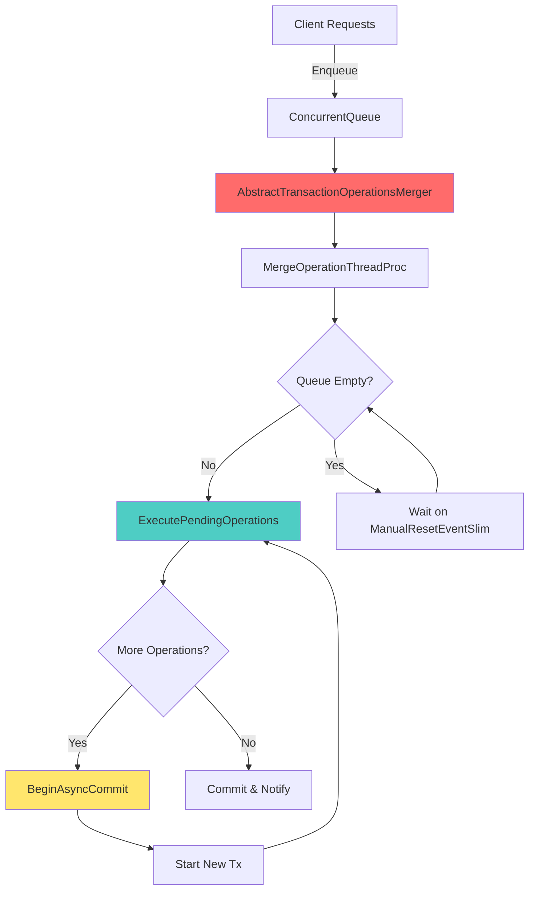

# Raven.Server - Módulo 2: Transaction Merging System ?

## ?? Visão Geral

O **Transaction Merging System** é o **coração da performance** do RavenDB. Este sistema é responsável por combinar múltiplas operações de escrita concorrentes em uma única transação ACID, reduzindo drasticamente o overhead de I/O e maximizando o throughput.

### Propósito
- **Batching automático** de operações de escrita
- **Redução de latência** através de async commit overlap
- **Maximização de throughput** através de transaction merging
- **Gerenciamento inteligente** de memória e recursos

### Posição na Arquitetura
```
HTTP Request ? RequestHandler ? MergedTransactionCommand ? TxMerger ? Voron
                                                               ?
                                                          Context Pool
```

### Estatísticas do Código
```
Arquivos principais: 7 arquivos
Linhas de código: ~2.500+ LOC
Complexidade: MUITO ALTA ?????
```

---

## ??? Arquitetura Interna

### Componentes Principais



### Classes Principais

#### 1. `AbstractTransactionOperationsMerger<TOperationContext, TTransaction>`
**Localização:** `src/Raven.Server/Documents/TransactionMerger/`

Classe abstrata que implementa toda a lógica de transaction merging.

```csharp
public abstract partial class AbstractTransactionOperationsMerger<TOperationContext, TTransaction>
    where TOperationContext : TransactionOperationContext<TTransaction>
    where TTransaction : RavenTransaction
{
    // Queue thread-safe para comandos pendentes
    private readonly ConcurrentQueue<MergedTransactionCommand<TOperationContext, TTransaction>> _operations;
    
    // Contador de operações concorrentes
    private readonly CountdownEvent _concurrentOperations;
    
    // Evento para sincronização
    private readonly ManualResetEventSlim _waitHandle;
    
    // Thread dedicada para merging
    private PoolOfThreads.LongRunningWork _txLongRunningOperation;
    
    // Configurações de performance
    private readonly double _maxTimeToWaitForPreviousTxInMs;
    private readonly long _maxTxSizeInBytes;
    private readonly double _maxTimeToWaitForPreviousTxBeforeRejectingInMs;
}
```

**Parâmetros Críticos de Configuração:**
- `MaxTimeToWaitForPreviousTx`: Tempo máximo para esperar tx anterior (padrão: 15ms)
- `MaxTxSize`: Tamanho máximo da transação (padrão: 64MB para 64-bits)
- `MaxTimeToWaitForPreviousTxBeforeRejecting`: Tempo antes de rejeitar operações (padrão: 60s)

#### 2. `DocumentsTransactionOperationsMerger`
**Localização:** `src/Raven.Server/Documents/TransactionMerger/`

Implementação concreta para operações de documentos.

```csharp
public sealed class DocumentsTransactionOperationsMerger 
    : AbstractTransactionOperationsMerger<DocumentsOperationContext, DocumentsTransaction>
{
    private readonly DocumentDatabase _database;
    
    internal override DocumentsTransaction BeginAsyncCommitAndStartNewTransaction(
        DocumentsTransaction previousTransaction, 
        DocumentsOperationContext currentContext)
    {
        return previousTransaction.BeginAsyncCommitAndStartNewTransaction(currentContext);
    }
    
    internal override void UpdateGlobalReplicationInfoBeforeCommit(DocumentsOperationContext context)
    {
        if (string.IsNullOrEmpty(context.LastDatabaseChangeVector) == false)
        {
            _database.DocumentsStorage.SetDatabaseChangeVector(context, context.LastDatabaseChangeVector);
        }
        
        if (context.LastReplicationEtagFrom != null)
        {
            foreach (var repEtag in context.LastReplicationEtagFrom)
            {
                DocumentsStorage.SetLastReplicatedEtagFrom(context, repEtag.Key, repEtag.Value);
            }
        }
    }
}
```

#### 3. `MergedTransactionCommand<TOperationContext, TTransaction>`
**Localização:** `src/Raven.Server/Documents/TransactionMerger/Commands/`

Classe base para todos os comandos que podem ser merged.

```csharp
public abstract class MergedTransactionCommand<TOperationContext, TTransaction>
{
    // TaskCompletionSource para notificação assíncrona
    public readonly TaskCompletionSource<object> TaskCompletionSource = 
        new(TaskCreationOptions.RunContinuationsAsynchronously);
    
    // Exceção se ocorrer erro
    public Exception Exception;
    
    // Se deve tentar novamente em caso de erro
    public bool RetryOnError = false;
    
    // Se deve atualizar LastAccessTime
    public bool UpdateAccessTime = true;
    
    // Método template - subclasses implementam
    protected abstract long ExecuteCmd(TOperationContext context);
    
    // Execução com suporte a recording
    public virtual long Execute(TOperationContext context, RecordingState recordingState)
    {
        recordingState?.TryRecord(context, this);
        return ExecuteCmd(context);
    }
}
```

**Exemplo de Comando Concreto:**

```csharp
public sealed class DeleteDocumentCommand : DocumentMergedTransactionCommand
{
    private readonly string _id;
    private readonly string _expectedChangeVector;
    private readonly DocumentDatabase _database;
    
    public DocumentsStorage.DeleteOperationResult? DeleteResult;
    
    protected override long ExecuteCmd(DocumentsOperationContext context)
    {
        DeleteResult = _database.DocumentsStorage.Delete(context, _id, _expectedChangeVector);
        return 1; // número de operações executadas
    }
}
```

---

## ?? Fluxo de Execução Detalhado

### 1. Enfileiramento (Enqueue)

```csharp
public async Task Enqueue(MergedTransactionCommand<TOperationContext, TTransaction> cmd)
{
    Debug.Assert(cmd.TaskCompletionSource.Task.IsCompleted == false);
    
    if (_initialized == false)
        throw new InvalidOperationException($"Tx Merger for '{_resourceName}' is not initialized.");
    
    _edi?.Throw(); // Propaga exceções fatais
    
    // 1. Adiciona comando à fila thread-safe
    _operations.Enqueue(cmd);
    
    // 2. Sinaliza thread de merging
    _waitHandle.Set();
    
    // 3. Incrementa contador de operações concorrentes
    if (_concurrentOperations.TryAddCount() == false)
        ThrowTxMergerWasDisposed();
    
    try
    {
        // 4. Aguarda execução assíncrona
        await cmd.TaskCompletionSource.Task.ConfigureAwait(false);
    }
    finally
    {
        // 5. Decrementa contador
        _concurrentOperations.Signal();
    }
}
```

**? Performance Note:**
- `ConcurrentQueue` é lock-free (usa CAS operations)
- `ManualResetEventSlim` é mais eficiente que `ManualResetEvent` para waits curtos
- `TaskCompletionSource` com `RunContinuationsAsynchronously` evita stack diving

### 2. Thread de Merging (MergeOperationThreadProc)

```csharp
private void MergeOperationThreadProc()
{
    ThreadHelper.TrySetThreadPriority(ThreadPriority.AboveNormal, TransactionMergerThreadName, _log);
    
    while (_runTransactions)
    {
        _recording.State?.Prepare(ref _recording.State);
        
        if (_operations.IsEmpty)
        {
            // Otimização: Zera buffer de compressão para databases encriptados
            if (_isEncrypted)
            {
                using (_contextPool.AllocateOperationContext(out TOperationContext ctx))
                using (ctx.OpenWriteTransaction())
                {
                    ctx.Environment.Options.Encryption.JournalCompressionBufferHandler
                        .ZeroCompressionBuffer(ctx.Transaction.InnerTransaction.LowLevelTransaction);
                }
            }
            
            // Aguarda novas operações
            using (var generalMeter = GeneralWaitPerformanceMetrics.MeterPerformanceRate())
            {
                generalMeter.IncrementCounter(1);
                _waitHandle.Wait(_shutdown);
            }
            _waitHandle.Reset();
        }
        
        MergeTransactionsOnce(); // ?? CORE LOGIC
    }
}
```

### 3. Merging de Transações (MergeTransactionsOnce)

```csharp
private void MergeTransactionsOnce()
{
    TOperationContext context = null;
    IDisposable returnContext = null;
    TTransaction tx = null;
    
    try
    {
        var pendingOps = GetBufferForPendingOps(); // Pool de listas
        returnContext = _contextPool.AllocateOperationContext(out context);
        
        // 1. Inicia transação
        _recording.State?.TryRecord(context, TxInstruction.BeginTx);
        tx = context.OpenWriteTransaction();
        
        PendingOperations result;
        try
        {
            var transactionMeter = TransactionPerformanceMetrics.MeterPerformanceRate();
            try
            {
                // 2. Executa operações pendentes
                result = ExecutePendingOperationsInTransaction(
                    pendingOps, context, null, ref transactionMeter);
                    
                // 3. Atualiza informações de replicação
                UpdateGlobalReplicationInfoBeforeCommit(context);
            }
            finally
            {
                transactionMeter.Dispose();
            }
        }
        catch (HighDirtyMemoryException highDirtyMemoryException)
        {
            // Cancela operações se memória dirty está alta
            NotifyHighDirtyMemoryFailure(pendingOps, highDirtyMemoryException);
            return;
        }
        catch (Exception e)
        {
            // Tenta executar cada operação independentemente
            NotifyTransactionFailureAndRerunIndependently(pendingOps, e);
            return;
        }
        
        switch (result)
        {
            case PendingOperations.CompletedAll:
                try
                {
                    _recording.State?.TryRecord(context, TxInstruction.Commit);
                    tx.Commit();
                    tx.Dispose();
                }
                catch (Exception e)
                {
                    foreach (var op in pendingOps)
                        op.Exception = e;
                }
                finally
                {
                    NotifyOnThreadPool(pendingOps);
                }
                return;
                
            case PendingOperations.HasMore:
                // ?? Inicia Async Commit Overlap
                MergeTransactionsWithAsyncCommit(ref context, ref returnContext, pendingOps);
                return;
        }
    }
    finally
    {
        using (returnContext)
        using (context?.Transaction)
        {
            _recording.State?.TryRecord(context, TxInstruction.DisposeTx, 
                context?.Transaction != null && context.Transaction.Disposed == false);
        }
    }
}
```

### 4. Execução de Operações Pendentes

```csharp
private PendingOperations ExecutePendingOperationsInTransaction(
    List<MergedTransactionCommand<TOperationContext, TTransaction>> executedOps,
    TOperationContext context,
    Task previousOperation, 
    ref PerformanceMetrics.DurationMeasurement meter)
{
    _alreadyListeningToPreviousOperationEnd = false;
    context.TransactionMarkerOffset = 1;
    var sp = Stopwatch.StartNew();
    
    do
    {
        // Incrementa marker para replicação
        context.TransactionMarkerOffset++;
        
        // 1. Tenta pegar próxima operação
        if (TryGetNextOperation(previousOperation, out var op, ref meter) == false)
            break;
        
        executedOps.Add(op);
        
        var llt = context.Transaction.InnerTransaction.LowLevelTransaction;
        
        // 2. Verifica dirty memory
        var dirtyMemoryState = LowMemoryNotification.Instance.DirtyMemoryState;
        if (dirtyMemoryState.IsHighDirty)
        {
            var now = _time.GetUtcNow();
            if (now - _lastHighDirtyMemCheck > _timeToCheckHighDirtyMemory.AsTimeSpan)
            {
                GlobalFlushingBehavior.GlobalFlusher.Value?.MaybeFlushEnvironment(context.Environment);
                _lastHighDirtyMemCheck = now;
            }
            
            throw new HighDirtyMemoryException(
                $"Operation cancelled due to high dirty memory. " +
                $"Total Scratch: {dirtyMemoryState.TotalDirty}");
        }
        
        // 3. Executa comando
        meter.IncrementCounter(1);
        meter.IncrementCommands(op.Execute(context, _recording.State));
        
        if (op.UpdateAccessTime)
            UpdateLastAccessTime(_time.GetUtcNow());
        
        // 4. Calcula tamanho modificado
        var modifiedSize = llt.NumberOfModifiedPages * Constants.Storage.PageSize;
        modifiedSize += llt.AdditionalMemoryUsageSize.GetValue(SizeUnit.Bytes);
        
        // 5. Decisão de continuar ou fechar transação
        var canCloseCurrentTx = previousOperation == null || previousOperation.IsCompleted;
        
        if (canCloseCurrentTx || _is32Bits)
        {
            if (_operations.IsEmpty)
                break; // Nada mais para fazer
                
            if (sp.ElapsedMilliseconds > _maxTimeToWaitForPreviousTxInMs)
                break; // Timeout
                
            if (modifiedSize > _maxTxSizeInBytes)
                break; // Transação muito grande
                
            continue; // Continua processando
        }
        
        // 6. Async commit em andamento
        if (modifiedSize < _maxTxSizeInBytes)
            continue; // Ainda cabe
            
        // 7. Rejeita operações se necessário
        UnlikelyRejectOperations(previousOperation, sp, llt, modifiedSize);
        break;
        
    } while (true);
    
    var currentOperationsCount = _operations.Count;
    var status = GetPendingOperationsStatus(context, currentOperationsCount == 0);
    
    if (_log.IsDebugEnabled)
    {
        _log.Debug($"Merged {executedOps.Count:#,#;;0} operations in {sp.Elapsed} " +
                   $"with {currentOperationsCount:#,#;;0} remaining. Status: {status}");
    }
    
    return status;
}
```

---

## ?? Técnica de Performance #1: Async Commit Overlap

### O Problema
Commits de transação são operações de I/O síncronas e caras. Enquanto uma transação está commitando, novas operações ficam aguardando.

### A Solução: Async Commit Overlap

```csharp
private void MergeTransactionsWithAsyncCommit(
    ref TOperationContext previous,
    ref IDisposable returnPreviousContext,
    List<MergedTransactionCommand<TOperationContext, TTransaction>> previousPendingOps)
{
    TOperationContext current = null;
    IDisposable currentReturnContext = null;
    
    try
    {
        while (true)
        {
            currentReturnContext = _contextPool.AllocateOperationContext(out current);
            
            try
            {
                // ?? MAGIA: Inicia commit async da tx anterior E cria nova tx
                _recording.State?.TryRecord(current, TxInstruction.BeginAsyncCommitAndStartNewTransaction);
                current.Transaction = BeginAsyncCommitAndStartNewTransaction(
                    previous.Transaction, current);
            }
            catch (Exception e)
            {
                foreach (var op in previousPendingOps)
                    op.Exception = e;
                NotifyOnThreadPool(previousPendingOps);
                return;
            }
            
            var currentPendingOps = GetBufferForPendingOps();
            PendingOperations result;
            bool calledCompletePreviousTx = false;
            
            try
            {
                var transactionMeter = TransactionPerformanceMetrics.MeterPerformanceRate();
                try
                {
                    // Executa operações na NOVA transação
                    // enquanto a ANTERIOR está commitando em background
                    result = ExecutePendingOperationsInTransaction(
                        currentPendingOps, 
                        current,
                        previous.Transaction.InnerTransaction.LowLevelTransaction.AsyncCommit, 
                        ref transactionMeter);
                        
                    UpdateGlobalReplicationInfoBeforeCommit(current);
                }
                finally
                {
                    transactionMeter.Dispose();
                }
                
                // Aguarda conclusão da transação anterior
                calledCompletePreviousTx = true;
                CompletePreviousTransaction(previous, previous.Transaction, 
                    ref previousPendingOps, throwOnError: true);
            }
            catch (HighDirtyMemoryException highDirtyMemoryException)
            {
                NotifyHighDirtyMemoryFailure(currentPendingOps, highDirtyMemoryException);
                return;
            }
            catch (Exception e)
            {
                NotifyTransactionFailureAndRerunIndependently(currentPendingOps, e);
                return;
            }
            
            // Descarta contexto anterior
            previous.Transaction.Dispose();
            returnPreviousContext.Dispose();
            
            // Atual vira anterior
            previous = current;
            returnPreviousContext = currentReturnContext;
            
            switch (result)
            {
                case PendingOperations.CompletedAll:
                    _recording.State?.TryRecord(current, TxInstruction.Commit);
                    previous.Transaction.Commit();
                    NotifyOnThreadPool(currentPendingOps);
                    return;
                    
                case PendingOperations.HasMore:
                    previousPendingOps = currentPendingOps;
                    break; // Continua loop
            }
        }
    }
    catch
    {
        current?.Transaction?.Dispose();
        currentReturnContext?.Dispose();
        throw;
    }
}
```

**?? Ganho de Performance:**
```
Sem Async Commit:
??????????    ??????????    ??????????
? Tx 1   ? -> ? Commit ? -> ? Tx 2   ? -> ...
? 5ms    ?    ? 10ms   ?    ? 5ms    ?
??????????    ??????????    ??????????
Total: 20ms para 2 transações

Com Async Commit Overlap:
??????????
? Tx 1   ?
? 5ms    ?
??????????
    ?
??????????????
? Commit Tx1 ? (background)
? 10ms       ?
??????????????
    ? (overlap!)
??????????
? Tx 2   ?
? 5ms    ?
??????????
Total: ~12-15ms para 2 transações (40-50% mais rápido!)
```

---

## ?? Técnica de Performance #2: Object Pooling

### Pooling de Listas de Comandos

```csharp
// Pool thread-safe de listas para reduzir alocações
private readonly ConcurrentQueue<List<MergedTransactionCommand<TOperationContext, TTransaction>>> 
    _opsBuffers = new();

private List<MergedTransactionCommand<TOperationContext, TTransaction>> GetBufferForPendingOps()
{
    if (_opsBuffers.TryDequeue(out var pendingOps) == false)
    {
        return new List<MergedTransactionCommand<TOperationContext, TTransaction>>();
    }
    return pendingOps;
}

private void DoCommandsNotification(object cmds)
{
    var pendingOperations = (List<MergedTransactionCommand<TOperationContext, TTransaction>>)cmds;
    
    foreach (var op in pendingOperations)
    {
        DoCommandNotification(op);
    }
    
    // Retorna lista ao pool
    pendingOperations.Clear();
    _opsBuffers.Enqueue(pendingOperations);
}
```

**?? Benefício:**
- Reduz alocações no GEN0
- Evita coletas frequentes de GC
- Especialmente importante em cenários de alto throughput

---

## ?? Técnica de Performance #3: High Dirty Memory Protection

### Problema
Quando há muita memória "dirty" (modificada mas não flushed), o sistema pode ficar lento ou travar.

### Solução: Checagem Proativa

```csharp
var dirtyMemoryState = LowMemoryNotification.Instance.DirtyMemoryState;
if (dirtyMemoryState.IsHighDirty)
{
    var now = _time.GetUtcNow();
    if (now - _lastHighDirtyMemCheck > _timeToCheckHighDirtyMemory.AsTimeSpan)
    {
        // Força flush do environment
        GlobalFlushingBehavior.GlobalFlusher.Value?.MaybeFlushEnvironment(context.Environment);
        _lastHighDirtyMemCheck = now;
    }
    
    throw new HighDirtyMemoryException(
        $"Operation cancelled due to high dirty memory. " +
        $"Total Scratch: {dirtyMemoryState.TotalDirty}");
}
```

**??? Estratégia de Proteção:**
1. Monitora constantemente o estado de dirty memory
2. Força flush proativo quando limites são atingidos
3. Cancela operações para evitar OOM
4. Notifica todas as operações pendentes com exceção específica

---

## ?? Técnica de Performance #4: Rejeição de Operações em Overload

### Cenário
Transação anterior ainda commitando, nova transação crescendo muito, operações chegando.

### Solução: Timeouts e Rejeição

```csharp
private void UnlikelyRejectOperations(
    IAsyncResult previousOperation, 
    Stopwatch sp, 
    LowLevelTransaction llt, 
    long modifiedSize)
{
    WaitHandle[] waitHandles = {
        _waitHandle.WaitHandle,
        previousOperation.AsyncWaitHandle
    };
    
    while (previousOperation.IsCompleted == false)
    {
        _waitHandle.Reset();
        
        var timeToWait = (int)_maxTimeToWaitForPreviousTxBeforeRejectingInMs - 
                         (int)sp.ElapsedMilliseconds;
        
        if (timeToWait < 0)
            timeToWait = Timeout.Infinite;
        
        var waitAny = WaitHandle.WaitAny(waitHandles, timeToWait);
        
        if (waitAny == 1) // Previous operation completed
            break;
        
        if (sp.ElapsedMilliseconds < _maxTimeToWaitForPreviousTxBeforeRejectingInMs)
            continue;
        
        if (_operations.IsEmpty)
            continue;
        
        // ?? REJEITA OPERAÇÕES NOVAS
        var timeout = new TimeoutException(
            $"Transaction #{llt.Id} waiting for {sp.Elapsed}, " +
            $"size: {new Size(modifiedSize, SizeUnit.Bytes)}");
        
        var rejectedBuffer = GetBufferForPendingOps();
        while (_operations.TryDequeue(out var operationToReject))
        {
            operationToReject.Exception = timeout;
            rejectedBuffer.Add(operationToReject);
        }
        
        NotifyOnThreadPool(rejectedBuffer);
    }
}
```

**?? Trade-off:**
- **Protege** o database de OOM
- **Mantém** responsividade do sistema
- **Falha rápido** em vez de travar

---

## ?? Técnica de Performance #5: Transaction Recording

### Propósito
Permite gravar todas as operações de transação para replay/debug.

```csharp
public sealed class EnabledRecordingState : RecordingState
{
    public override void TryRecord(
        TOperationContext context, 
        MergedTransactionCommand<TOperationContext, TTransaction> operation)
    {
        var obj = new RecordingCommandDetails<TOperationContext, TTransaction>(
            operation.GetType().Name)
        {
            Command = operation.ToDto(context)
        };
        
        TryRecord(obj, context);
    }
    
    private void TryRecord(RecordingDetails commandDetails, JsonOperationContext context)
    {
        try
        {
            using (var commandDetailsReader = SerializeRecordingCommandDetails(context, commandDetails))
            using (var writer = new BlittableJsonTextWriter(context, _txMerger._recording.Stream))
            {
                writer.WriteComma();
                context.Write(writer, commandDetailsReader);
            }
        }
        catch
        {
            // Ignora erros de recording para não afetar operação normal
        }
    }
}
```

**Instruções Gravadas:**
```csharp
public enum TxInstruction
{
    BeginTx,
    Commit,
    DisposeTx,
    BeginAsyncCommitAndStartNewTransaction,
    EndAsyncCommit,
    DisposePrevTx
}
```

---

## ?? Padrões de Design Identificados

### 1. **Command Pattern**
```csharp
// Cada operação é um comando encapsulado
public abstract class MergedTransactionCommand
{
    protected abstract long ExecuteCmd(TOperationContext context);
}

// Exemplo concreto
public sealed class DeleteDocumentCommand : DocumentMergedTransactionCommand
{
    protected override long ExecuteCmd(DocumentsOperationContext context)
    {
        DeleteResult = _database.DocumentsStorage.Delete(context, _id, _expectedChangeVector);
        return 1;
    }
}
```

**Por que?**
- Encapsula operações como objetos
- Permite queuing e batching
- Facilita undo/redo (via recording)
- Desacopla invocador de executor

### 2. **Producer-Consumer Pattern**
```csharp
// Producer: Múltiplas threads HTTP
public async Task Enqueue(MergedTransactionCommand cmd)
{
    _operations.Enqueue(cmd); // Thread-safe queue
    _waitHandle.Set();
    await cmd.TaskCompletionSource.Task;
}

// Consumer: Thread única de merging
private void MergeOperationThreadProc()
{
    while (_runTransactions)
    {
        if (_operations.IsEmpty)
            _waitHandle.Wait(_shutdown);
        
        MergeTransactionsOnce();
    }
}
```

**Por que?**
- Desacopla produção de consumo
- Permite batching natural
- Única thread de escrita evita contenção

### 3. **Template Method Pattern**
```csharp
public abstract class AbstractTransactionOperationsMerger
{
    // Template method
    private void MergeTransactionsOnce()
    {
        // ... código comum ...
        UpdateGlobalReplicationInfoBeforeCommit(context); // Hook
    }
    
    // Hook methods - subclasses implementam
    internal abstract void UpdateGlobalReplicationInfoBeforeCommit(TOperationContext context);
    internal abstract TTransaction BeginAsyncCommitAndStartNewTransaction(...);
    protected abstract void UpdateLastAccessTime(DateTime time);
}

// Implementação concreta
public sealed class DocumentsTransactionOperationsMerger
{
    internal override void UpdateGlobalReplicationInfoBeforeCommit(DocumentsOperationContext context)
    {
        if (string.IsNullOrEmpty(context.LastDatabaseChangeVector) == false)
            _database.DocumentsStorage.SetDatabaseChangeVector(context, context.LastDatabaseChangeVector);
    }
}
```

### 4. **Object Pool Pattern**
```csharp
private readonly ConcurrentQueue<List<MergedTransactionCommand>> _opsBuffers = new();

private List<MergedTransactionCommand> GetBufferForPendingOps()
{
    if (_opsBuffers.TryDequeue(out var pendingOps) == false)
        return new List<MergedTransactionCommand>();
    return pendingOps;
}

// Retorna ao pool
pendingOperations.Clear();
_opsBuffers.Enqueue(pendingOperations);
```

### 5. **State Pattern (Recording)**
```csharp
public abstract class RecordingState
{
    public abstract void TryRecord(...);
    public abstract void Prepare(ref RecordingState state);
}

// Estado: Antes de habilitar
public sealed class BeforeEnabledRecordingState : RecordingState
{
    public override void Prepare(ref RecordingState state)
    {
        // Transição de estado
        state = new EnabledRecordingState(_txMerger);
    }
}

// Estado: Habilitado
public sealed class EnabledRecordingState : RecordingState
{
    public override void TryRecord(...) { /* grava */ }
}
```

---

## ?? Tratamento de Erros

### 1. **Recuperação de OOM**
```csharp
catch (Exception e) when (e is EarlyOutOfMemoryException || e is OutOfMemoryException)
{
    _log.Warn("OOM in tx merger, aborting for 3 seconds", e);
    
    ClearQueueWithException(e);
    oomTimer.Restart();
    
    while (_runTransactions)
    {
        var timeSpan = TimeSpan.FromSeconds(3) - oomTimer.Elapsed;
        if (timeSpan <= TimeSpan.Zero || _waitHandle.Wait(timeSpan, _shutdown) == false)
            break;
        
        ClearQueueWithException(e);
    }
    
    // Loop reinicia automaticamente
}
```

**Estratégia:**
- Limpa fila de operações
- Aguarda 3 segundos para sistema se recuperar
- Reinicia automaticamente
- Evita cascata de falhas

### 2. **Erros Fatais**
```csharp
catch (Exception e)
{
    _log.Fatal("Serious failure in tx merging thread, database must be restarted!", e);
    
    Interlocked.Exchange(ref _edi, ExceptionDispatchInfo.Capture(e));
    
    while (_runTransactions)
    {
        ClearQueueWithException(e);
        _waitHandle.Wait(_shutdown);
        _waitHandle.Reset();
    }
}

// No próximo Enqueue
public async Task Enqueue(MergedTransactionCommand cmd)
{
    _edi?.Throw(); // Re-lança exceção fatal
    // ...
}
```

**Estratégia:**
- Captura stack trace completo
- Notifica todas as operações
- Bloqueia novos enqueues
- Força restart do database

### 3. **Retry de Operações Individuais**
```csharp
private void RunEachOperationIndependently(List<MergedTransactionCommand> pendingOps)
{
    foreach (var op in pendingOps)
    {
        bool alreadyRetried = false;
        
        while (true)
        {
            try
            {
                using (_contextPool.AllocateOperationContext(out TOperationContext context))
                using (var tx = context.OpenWriteTransaction())
                {
                    op.RetryOnError = false;
                    op.Execute(context, _recording.State);
                    tx.Commit();
                }
                
                NotifyOnThreadPool(op);
            }
            catch (Exception e)
            {
                if (alreadyRetried == false && op.RetryOnError)
                {
                    alreadyRetried = true;
                    continue; // Retry
                }
                
                op.Exception = e;
                NotifyOnThreadPool(op);
            }
            break;
        }
    }
}
```

**Estratégia:**
- Cada operação é tentada individualmente
- Permite 1 retry se `RetryOnError = true`
- Isola falhas
- Garante que operações bem-sucedidas não sejam afetadas

---

## ?? Métricas & Performance

### Métricas Coletadas

```csharp
public DatabasePerformanceMetrics GeneralWaitPerformanceMetrics = 
    new(DatabasePerformanceMetrics.MetricType.GeneralWait, 256, 1);

public DatabasePerformanceMetrics TransactionPerformanceMetrics = 
    new(DatabasePerformanceMetrics.MetricType.Transaction, 256, 8);
```

**GeneralWaitPerformanceMetrics:**
- Tempo de espera quando fila está vazia
- Indicador de idle time do merger

**TransactionPerformanceMetrics:**
- Tempo total de execução de cada transação merged
- Número de comandos executados
- Permite calcular throughput

### Como Usar as Métricas

```csharp
// Durante wait
using (var generalMeter = GeneralWaitPerformanceMetrics.MeterPerformanceRate())
{
    generalMeter.IncrementCounter(1);
    _waitHandle.Wait(_shutdown);
}

// Durante execução
var transactionMeter = TransactionPerformanceMetrics.MeterPerformanceRate();
try
{
    result = ExecutePendingOperationsInTransaction(..., ref transactionMeter);
    
    // Incrementa para cada operação
    meter.IncrementCounter(1);
    meter.IncrementCommands(op.Execute(context, _recording.State));
}
finally
{
    transactionMeter.Dispose(); // Finaliza medição
}
```

### Logs de Debug

```csharp
if (_log.IsDebugEnabled)
{
    var opType = previousOperation == null ? string.Empty : "(async) ";
    _log.Debug($"Merged {executedOps.Count:#,#;;0} operations in {sp.Elapsed} " +
               $"{opType}with {currentOperationsCount:#,#;;0} operations remaining. " +
               $"Status: {status}");
}
```

**Exemplo de Output:**
```
Merged 47 operations in 00:00:00.0123456 (async) with 23 operations remaining. Status: HasMore
```

---

## ?? Integração com Outros Módulos

### 1. **Voron (Storage Engine)**
```csharp
// AbstractTransactionOperationsMerger usa Voron através de:
tx = context.OpenWriteTransaction();
tx.Commit();
tx.BeginAsyncCommitAndStartNewTransaction(currentContext);
```

**Protocolo:**
- Merger gerencia lifecycle de transações
- Voron fornece ACID guarantees
- Async commit é feature do Voron

### 2. **Context Pool**
```csharp
returnContext = _contextPool.AllocateOperationContext(out context);
// ... usa context ...
returnContext.Dispose(); // Retorna ao pool
```

**Protocolo:**
- Pool fornece contextos reutilizáveis
- Reduz alocações
- Thread-safe

### 3. **DocumentsStorage**
```csharp
// Comandos executam operações no storage
protected override long ExecuteCmd(DocumentsOperationContext context)
{
    DeleteResult = _database.DocumentsStorage.Delete(context, _id, _expectedChangeVector);
    return 1;
}
```

**Protocolo:**
- Comandos chamam métodos do DocumentsStorage
- Storage trabalha dentro do contexto de transação
- Change vectors são propagados

### 4. **Replication**
```csharp
internal override void UpdateGlobalReplicationInfoBeforeCommit(DocumentsOperationContext context)
{
    if (string.IsNullOrEmpty(context.LastDatabaseChangeVector) == false)
    {
        _database.DocumentsStorage.SetDatabaseChangeVector(context, context.LastDatabaseChangeVector);
    }
    
    if (context.LastReplicationEtagFrom != null)
    {
        foreach (var repEtag in context.LastReplicationEtagFrom)
        {
            DocumentsStorage.SetLastReplicatedEtagFrom(context, repEtag.Key, repEtag.Value);
        }
    }
}
```

**Protocolo:**
- Merger atualiza informações de replicação antes de commit
- Change vectors são sincronizados
- ETags de replicação são rastreados

---

## ?? Lições Aprendidas

### 1. **Single Writer Thread é Poderoso**
- Evita contenção de locks
- Permite batching natural
- Simplifica raciocínio sobre concorrência

**Quando aplicar:**
- Workloads com muitas escritas pequenas
- Quando throughput > latência individual
- Storage engines com single-writer model (como LMDB/Voron)

**Quando NÃO aplicar:**
- Workloads com poucas escritas grandes
- Quando latência individual é crítica
- Multi-master scenarios

### 2. **Async Commit Overlap é Game-Changer**
- 40-50% de melhoria em throughput
- Complexidade adicional gerenciável
- Trade-off: complexidade vs performance

**Quando aplicar:**
- Async commit disponível no storage engine
- Alto volume de operações
- I/O é gargalo

### 3. **Object Pooling Importa**
- Reduz pressão no GC
- Especialmente importante em hot paths
- Trade-off: memória vs alocações

### 4. **Fail Fast é Melhor que Hang**
- Timeouts e rejeição protegem o sistema
- Melhor falhar rapidamente que travar
- Clientes podem retry

### 5. **Métricas São Essenciais**
- Impossível otimizar sem medir
- Performance metrics in-process
- Permite debugging de produção

### 6. **Recording para Debug**
- Permite replay de problemas
- Overhead mínimo quando desabilitado
- Invaluável para troubleshooting

---

## ?? Referências

### Código-Fonte
- `src/Raven.Server/Documents/TransactionMerger/AbstractTransactionOperationsMerger.cs`
- `src/Raven.Server/Documents/TransactionMerger/DocumentsTransactionOperationsMerger.cs`
- `src/Raven.Server/Documents/TransactionMerger/Commands/MergedTransactionCommand.cs`
- `src/Raven.Server/Documents/TransactionMerger/Commands/DeleteDocumentCommand.cs`
- `src/Raven.Server/Documents/TransactionMerger/AbstractTransactionOperationsMerger.Recording.cs`
- `src/Raven.Server/ServerWide/TransactionMerger/ClusterTransactionOperationsMerger.cs`

### Configurações
```csharp
// RavenConfiguration.TransactionMergerConfiguration
MaxTimeToWaitForPreviousTx = 15ms (padrão)
MaxTxSize = 64MB (64-bits) ou 16MB (32-bits)
MaxTimeToWaitForPreviousTxBeforeRejecting = 60s
```

### Commits Relevantes
- Buscar por "transaction merger" no histórico do Git
- Buscar por "async commit" para otimizações
- Issues relacionadas a performance

### Documentação Externa
- [LMDB Async Commit](http://www.lmdb.tech/doc/)
- [Voron Storage Engine](https://github.com/ayende/ravendb/tree/v5.4/src/Voron)

---

## ?? Próximos Passos

Este módulo cobriu o **Transaction Merging System** em profundidade. Próximos módulos recomendados:

1. **Módulo 3: DocumentDatabase Lifecycle** - Como o merger é inicializado e integrado
2. **Módulo 4: Document Storage & CRUD** - Como comandos interagem com storage
3. **Módulo 5: Indexing Subsystem** - Como indexing usa o merger
4. **Módulo 7: Replication Engine** - Como replicação se integra com change vectors

---

**?? Fim do Módulo 2: Transaction Merging System**

Este é o **coração da performance** do RavenDB. Entender este sistema é fundamental para compreender como o RavenDB consegue alto throughput com garantias ACID.
